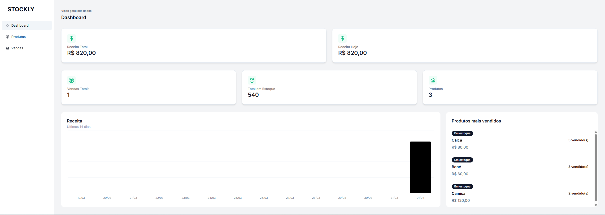
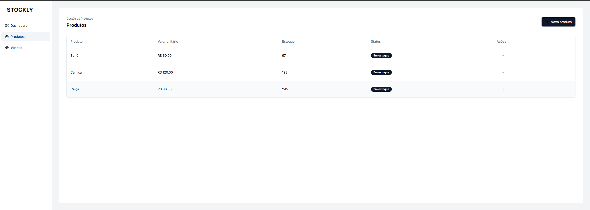

# 📦 Stockly


Sistema de controle de estoque desenvolvido para fins de estudo, utilizando tecnologias modernas do ecossistema JavaScript/TypeScript.

O projeto simula um ambiente real de gestão, com dashboard, controle de produtos e estrutura preparada para evolução como um sistema SaaS.

---

## 🌐 Demo

Acesse o projeto em produção:

👉 https://stockly-hrr1enwgq-sergiorbotelhos-projects.vercel.app/

---

## 📸 Preview

### Dashboard



### Produtos



---

## 🚀 Tecnologias utilizadas

### Frontend

- Next.js 16 (App Router)
- React
- TypeScript
- shadcn/ui
- Material UI

### Backend / Infra

- Node.js v22.14.0
- Prisma ORM
- PostgreSQL (NeonDB)

---

## 📚 Objetivo do projeto

Este projeto foi desenvolvido com foco em aprendizado prático, abordando:

- Estruturação de aplicações com Next.js (App Router)
- Integração com banco de dados usando Prisma
- Modelagem de dados relacional (PostgreSQL)
- Construção de dashboards e visualização de dados
- Criação de interfaces modernas e responsivas
- Organização de código escalável
- Integração fullstack (frontend + backend)

---

## ⚙️ Funcionalidades

- 📦 CRUD completo de produtos
- 🗂️ Organização por categorias
- 📊 Dashboard com métricas (estoque, movimentações, etc.)
- 🔄 Controle de entrada e saída de estoque
- 🧾 Estrutura preparada para relatórios

---

## 🧠 Decisões técnicas

- **Prisma ORM**
  Utilizado para garantir tipagem forte, produtividade e facilidade na manutenção das queries.

- **NeonDB (PostgreSQL Serverless)**
  Escolhido pela facilidade de integração com ambientes serverless e deploy na Vercel.

- **Next.js App Router**
  Utilizado para melhor organização do projeto, aproveitando Server e Client Components.

- **shadcn/ui**
  Desenvolvimento com componentes reutilizáveis e design moderno.

---

## 🗄️ Banco de Dados

O projeto utiliza:

- PostgreSQL hospedado no **NeonDB**
- Prisma para:
  - Migrations
  - Tipagem automática
  - Abstração de queries

---

## 🧱 Arquitetura

O projeto segue uma arquitetura moderna baseada em:

- App Router (Next.js)
- Separação de responsabilidades (UI / lógica / dados)
- Componentização
- Server e Client Components

---

## 📁 Estrutura do projeto

```
src/
 ├── app/            # Rotas e páginas (App Router)
 ├── components/     # Componentes reutilizáveis
 ├── services/       # Integração com APIs / lógica
 ├── prisma/         # Schema e migrations
 ├── utils/          # Funções auxiliares
```

---

## ⚙️ Como rodar o projeto

### Pré-requisitos

- Node.js v22.14.0+
- Conta no NeonDB ou PostgreSQL local
- npm, yarn ou pnpm

---

### 1. Clone o repositório

```bash
git clone https://github.com/sergiorbotelho/stockly.git
cd stockly
```

---

### 2. Instale as dependências

```bash
npm install
```

---

### 3. Configure as variáveis de ambiente

Crie um arquivo `.env` na raiz do projeto:

```env
DATABASE_URL="sua_url_do_neondb"
```

---

### 4. Execute as migrations

```bash
npx prisma migrate dev
```

---

### 5. Rode o projeto

```bash
npm run dev
```

A aplicação estará disponível em:

```
http://localhost:3000
```

---

## 🔐 Variáveis de ambiente

| Variável     | Descrição                  |
| ------------ | -------------------------- |
| DATABASE_URL | URL de conexão com o banco |

---

## 🧠 Aprendizados

Durante o desenvolvimento deste projeto, foram explorados conceitos como:

- ORM com Prisma
- Integração com banco em nuvem
- Arquitetura moderna com Next.js
- Criação de dashboards
- Componentização e reutilização de código
- Boas práticas de desenvolvimento fullstack

---

## 📌 Observação

Este projeto foi desenvolvido exclusivamente para fins de estudo e aprimoramento técnico.

---

## 👨‍💻 Autor

Desenvolvido por **Sergio Botelho**

- GitHub: https://github.com/sergiorbotelho

---

## 📄 Licença

Este projeto está sob a licença MIT.
